# Mapa simples do sistema

Atualizado em 12/05/2026.

Este documento mostra o sistema como uma historinha: quem chama primeiro, o que ele
olha, para onde manda os arquivos e onde pode dar erro.

## Ideia principal

```text
O Portal mostra quais notas existem.
A planilha mostra onde cada empresa guarda as notas.
As pastas mostram o que ja chegou.
Se faltar arquivo na pasta, o sistema deve trazer de novo.
```

## Desenho grande

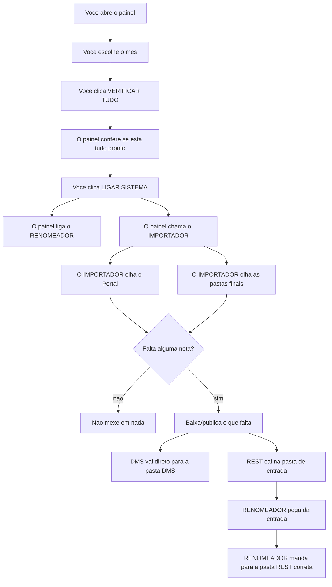

## O que acontece quando voce abre o painel

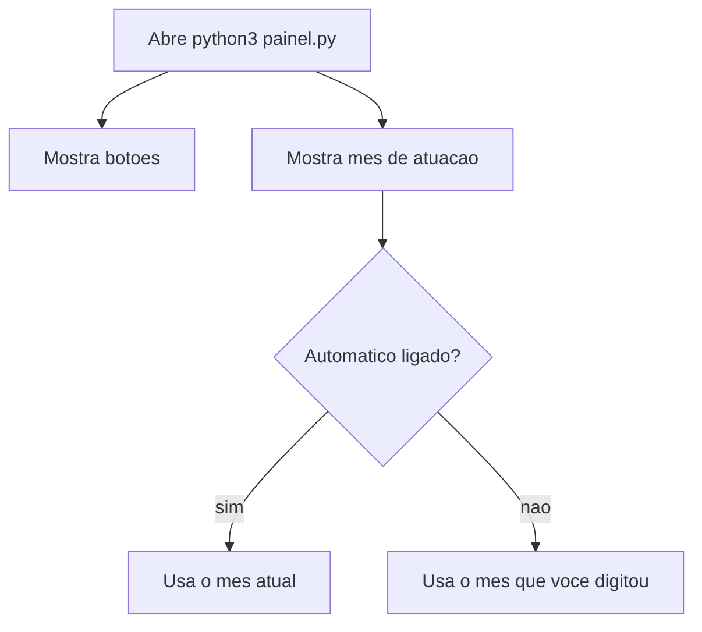

Em maio de 2026:

```text
Automatico ligado  -> painel usa 2026-05
Automatico desligado + 2026-04 digitado -> painel usa 2026-04
```

## Desenho: abrir painel e clicar VERIFICAR TUDO

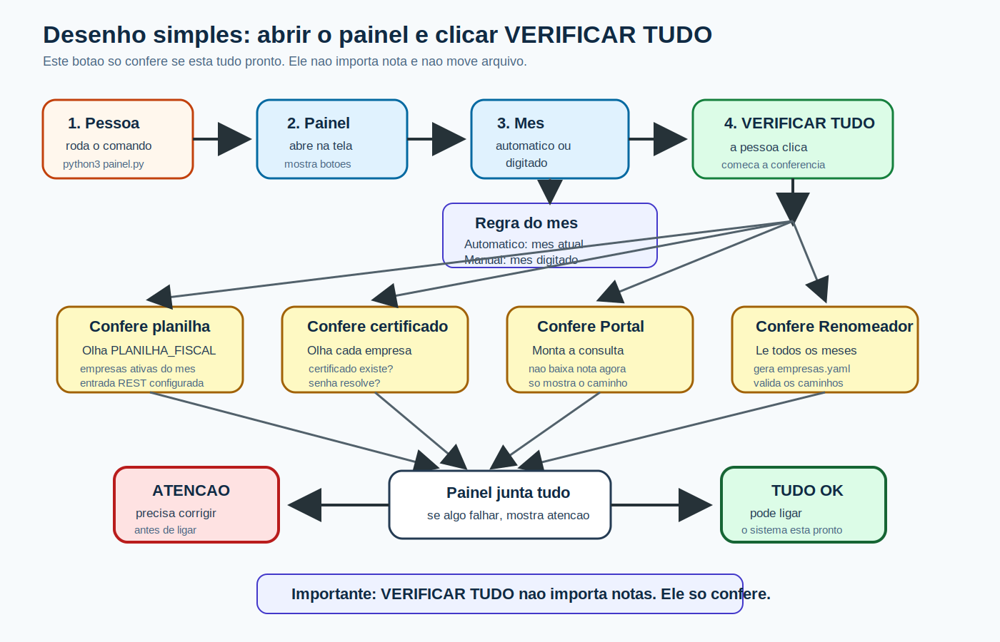

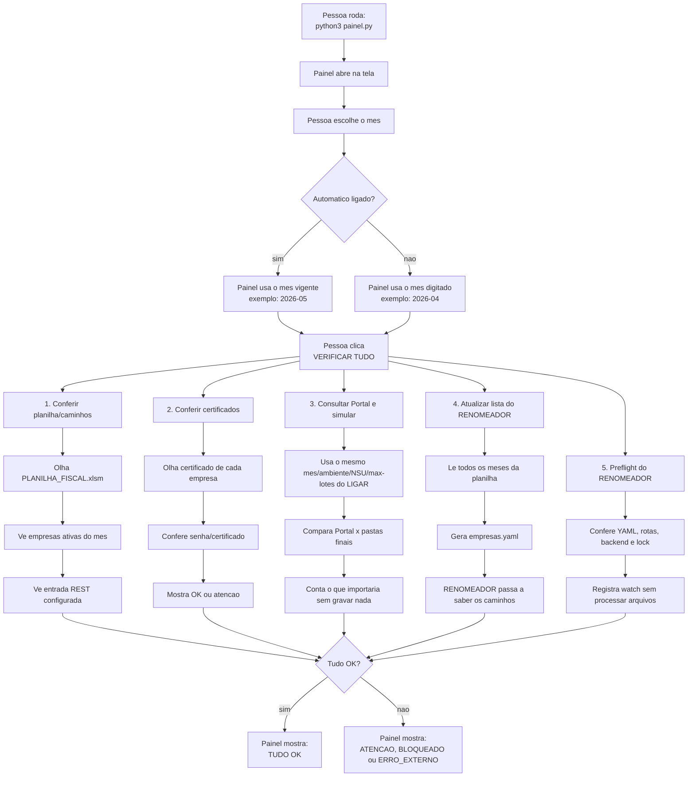

```text
Neste desenho, VERIFICAR TUDO e so conferencia fiel.
Ele nao importa nota.
Ele nao move arquivo.
Ele nao altera ledger.
Ele so responde: posso ligar o sistema com seguranca?
```

## Botao VERIFICAR TUDO

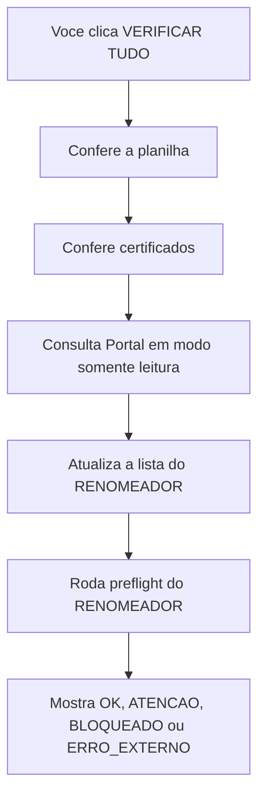

Em palavras simples:

```text
VERIFICAR TUDO nao importa nota.
Ele usa o mesmo motor do reconciliar em dry-run, sem publicar XML/PDF, sem baixar
DANFSe e sem alterar ledger.
```

## Botao LIGAR SISTEMA

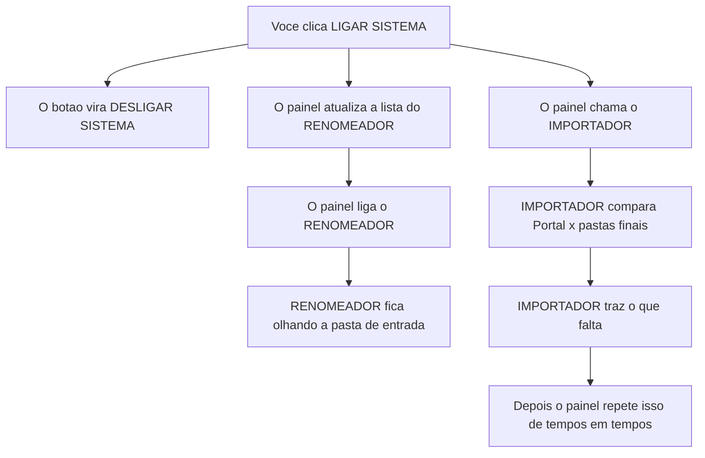

Em palavras simples:

```text
LIGAR SISTEMA liga dois trabalhadores:
1. RENOMEADOR fica olhando a entrada.
2. IMPORTADOR vai no Portal e busca o que falta.
```

## Trabalhador 1: IMPORTADOR

O IMPORTADOR e quem conversa com o Portal Nacional.

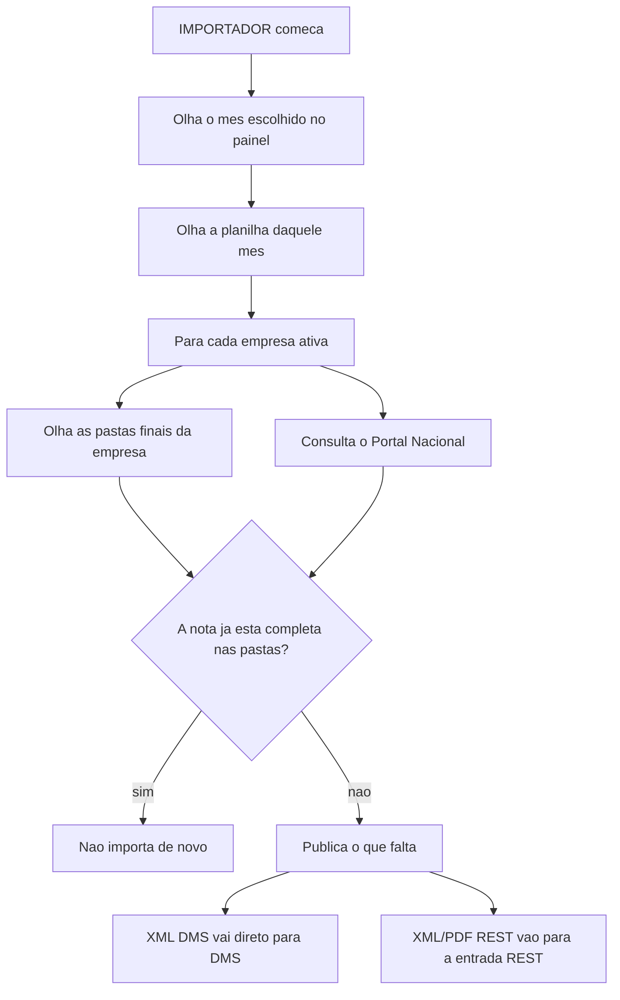

O IMPORTADOR decide assim:

```text
Portal tem a nota?
Sim.

A pasta final ja tem tudo?
Sim -> nao faz nada.
Nao -> publica de novo.
```

## Trabalhador 2: RENOMEADOR

O RENOMEADOR nao consulta o Portal. Ele so organiza XML/PDF REST.

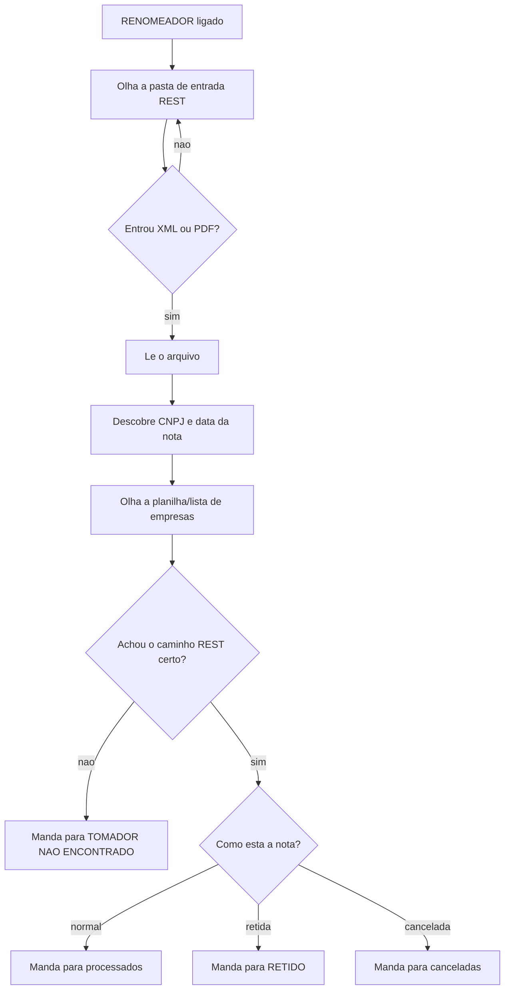

Em palavras simples:

```text
RENOMEADOR pega o que caiu na entrada.
Ele descobre de quem e a nota.
Ele joga na pasta REST correta.
```

## Caminho do arquivo REST

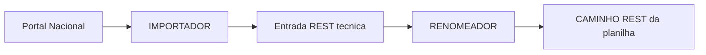

Em palavras simples:

```text
Arquivo REST nao vai direto para o cliente.
Ele passa primeiro pela entrada.
Depois o RENOMEADOR separa e manda para o lugar certo.
```

## Caminho do arquivo DMS

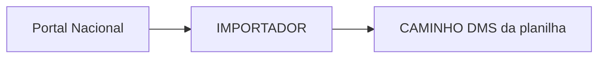

Em palavras simples:

```text
DMS nao passa pelo RENOMEADOR.
O IMPORTADOR manda DMS direto para a pasta DMS.
```

## Quando voce apaga arquivo da pasta final

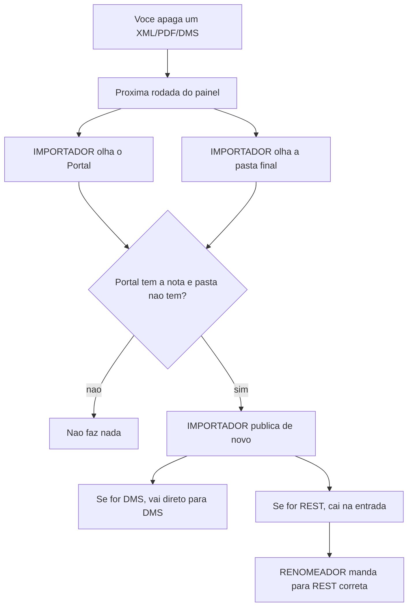

Essa e a regra mais importante:

```text
Quem manda e o Portal + a pasta final.
Log e ledger nao podem impedir uma nota apagada de voltar.
```

## O que cada parte faz

| Parte | Explicacao simples |
|---|---|
| Painel | Tela que voce usa para verificar, escolher mes, ligar e desligar |
| Planilha | Lista das empresas e dos caminhos das pastas |
| Importador | Busca no Portal o que falta |
| Renomeador | Organiza XML/PDF REST na pasta certa |
| Entrada REST | Fila temporaria entre Importador e Renomeador |
| CAMINHO REST | Pasta final dos XML/PDF REST |
| CAMINHO DMS | Pasta final dos XML DMS |
| Ledger/log | Diario do que aconteceu, mas nao manda na decisao |

## Onde olhar quando algo der errado

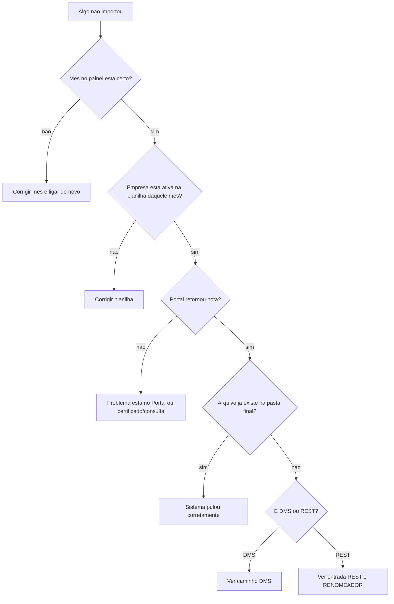

## Resumo de uma linha

```text
Voce liga o painel -> Importador busca o que falta -> Renomeador organiza REST -> DMS vai direto -> pastas finais viram a verdade.
```
